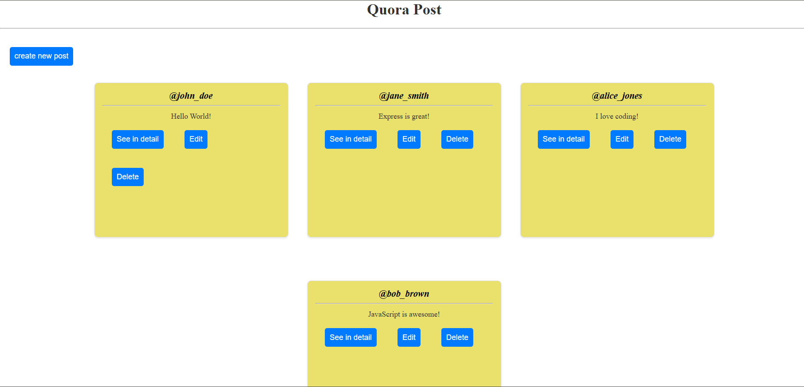
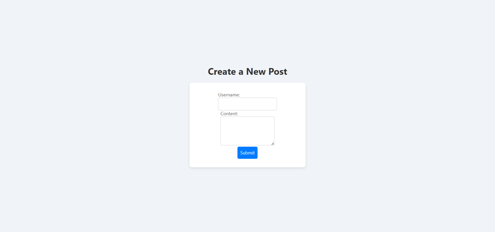
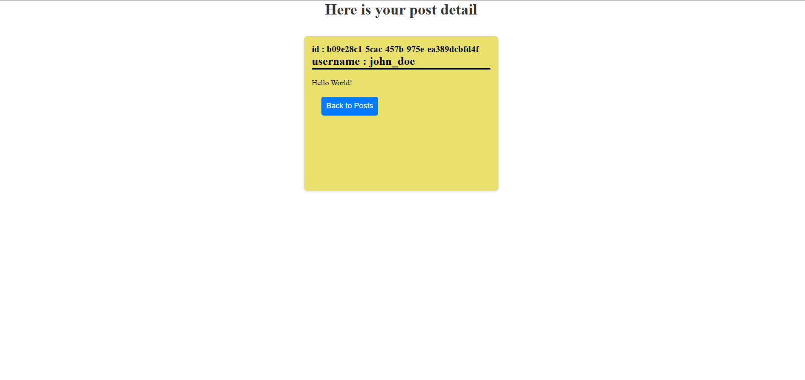
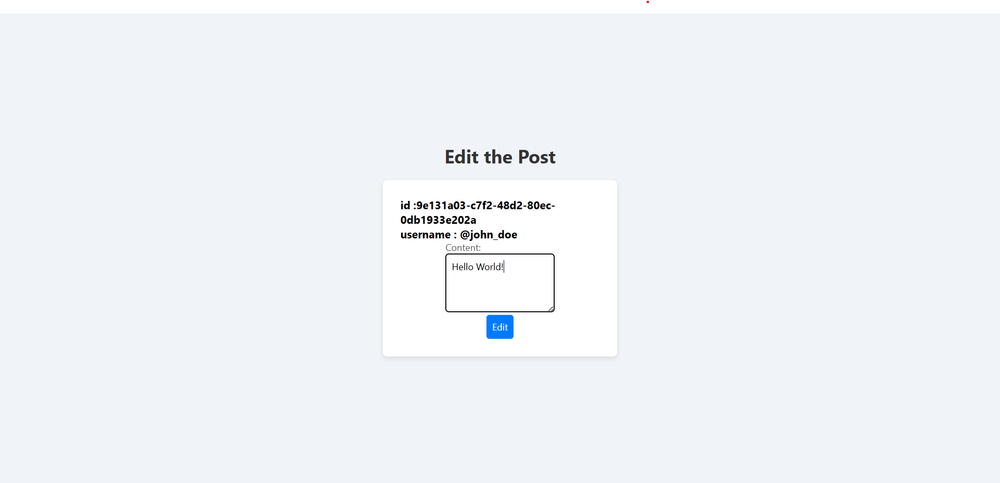

# 📝 Express Posts CRUD App

A simple **CRUD (Create, Read, Update, Delete)** web application built using **Node.js**, **Express.js**, and **EJS**.  
This app allows users to create posts, view all posts, edit existing posts, and delete posts — all rendered dynamically using EJS templates.

---

## 🚀 Features
- 🖋️ Create new posts with username and content  
- 📋 View all posts on the homepage  
- 🔍 View individual post details  
- ✏️ Edit post content using a friendly form  
- 🗑️ Delete posts (using method-override)  
- 🎨 Clean EJS-based frontend with static styling support  

---

## 🧰 Tech Stack

| Layer | Technology |
|:------|:------------|
| **Backend** | Node.js, Express.js |
| **Templating** | EJS |
| **Middleware** | Method-Override, UUID, Express URL Encoded |
| **Frontend** | HTML, CSS (in `public/` folder) |

---

## 📸 Screenshots

### 🏠 Homepage — All Posts  
Displays all posts dynamically with Edit and Delete options.  


---

### ➕ New Post Page  
Form to create a new post.  


---

### 👁️ View Post Page  
Displays a single post in detail.  


---

### ✏️ Edit Post Page  
Edit existing post content and save changes.  


---

## 📁 Project Structure

```bash
RestApi/
│
├── index.js              # Main server file
├── package.json          # Dependencies
├── views/                # EJS templates
│   ├── index.ejs
│   ├── new.ejs
│   ├── show.ejs
│   └── edit.ejs
│
├── public/               # Static files (CSS, etc.)
│   └── style.css
│
├── screenshots/          # Screenshots used in README
│   ├── home.png
│   ├── createPost.png
│   ├── seeDetailPost.png
│   └── edit.png
│
└── README.md
```
## 🧩 Routes Overview

| **Method** | **Route** | **Description** |
|:------------|:-----------|:----------------|
| **GET** | `/post` | Display all posts |
| **GET** | `/post/new` | Show form to create a post |
| **POST** | `/post` | Add a new post |
| **GET** | `/post/:id` | View a single post |
| **GET** | `/post/:id/edit` | Show edit form |
| **PATCH** | `/post/:id` | Update a post |
| **DELETE** | `/post/:id` | Delete a post |

---

## 🧠 Example Data

```js
let posts = [
  { id: uuidv4(), username: "john_doe", content: "Hello World!" },
  { id: uuidv4(), username: "jane_smith", content: "Express is great!" },
  { id: uuidv4(), username: "alice_jones", content: "I love coding!" },
  { id: uuidv4(), username: "bob_brown", content: "JavaScript is awesome!" },
];
